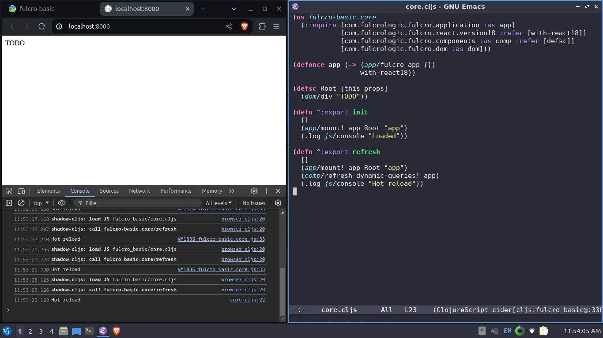

### DEPS
```bash
$ clojure # clojure deps
$ yarn # npm deps
```
### PLAY
```bash
$ yarn shadow-cljs watch :main
```
### SERVER
- HTTP server at http://localhost:8000
- server session at http://localhost:9630
### SCREENSHOT
<p align='center'></p>
